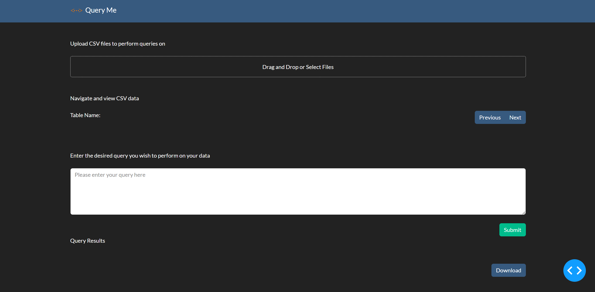
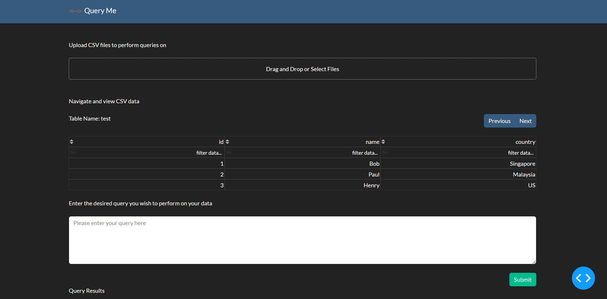
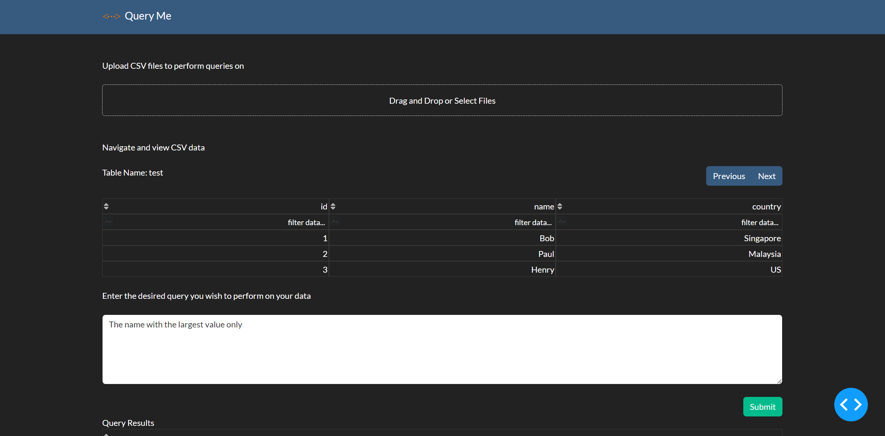
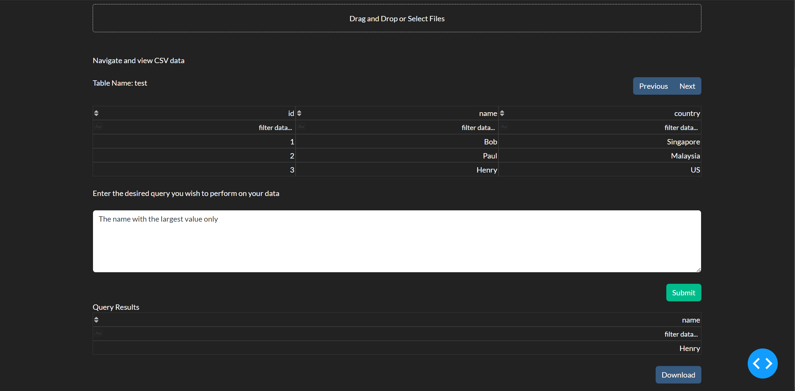

# query-me

## 1. Overview
A simple app leveraging GPT-3 to help non-technical users to query from CSV files with free text. This was inspired from a challenge faced by non-technical users requiring to perform certain data extraction from one or more possible CSV files.

The app is served on `Docker` and built using `Dash` for quick development purposes.


## 2. Getting Started
Firstly, visit OpenAI's website to obtain an API key to call their GPT-3 services. Copy the `.env.template` file and rename that copy as `.env`. Update the `.env` file with the API key from OpenAI. Once done, simply run the following commands to build and run the docker:

```
docker build -t query-me .
```

```
docker run -p 8050:8050 --name query-me --env-file .env query-me
```

Navigate to `http://localhost:8050` and you should see the application.





## 3. How To Use The Application
To use the application, simply upload one or more CSV files by drag and dropping or clicking the upload area. On succesful upload, you should see the tables displayed as shown below.



If there are more than 1 CSV files uploaded, simply navigate to view the other tables in the other CSV files by using the `Previous` and `Next` buttons.

After which, input the query in the free text area below the tables.



Once the query is input, click on the `Submit` button to submit the query along with the CSV files. After a while, the result of the query will be displayed in the table below the free text area.



The output results can also be downloaded by simply clicking on the `Download` button below.

**Note: To get a desirable results, please try variations of the same query e.g. Who has the largest value, The name with the largest value, etc.**


## 4. Quick Explanation On How It Works
Given the need to perform an SQL query, the CSV files are actually converted into an intermediary SQLite database. Then, extracting the column information for each table, along with the free text query, will be combined to form the prompt for GPT-3. The returned result will then be used to query the SQLite database, generating a pandas dataframe to be downloaded as a CSV file.

To understand more about GPT-3, please read the [paper](https://arxiv.org/abs/2005.14165) and also visit [OpenAI](https://openai.com/) website to know more.
